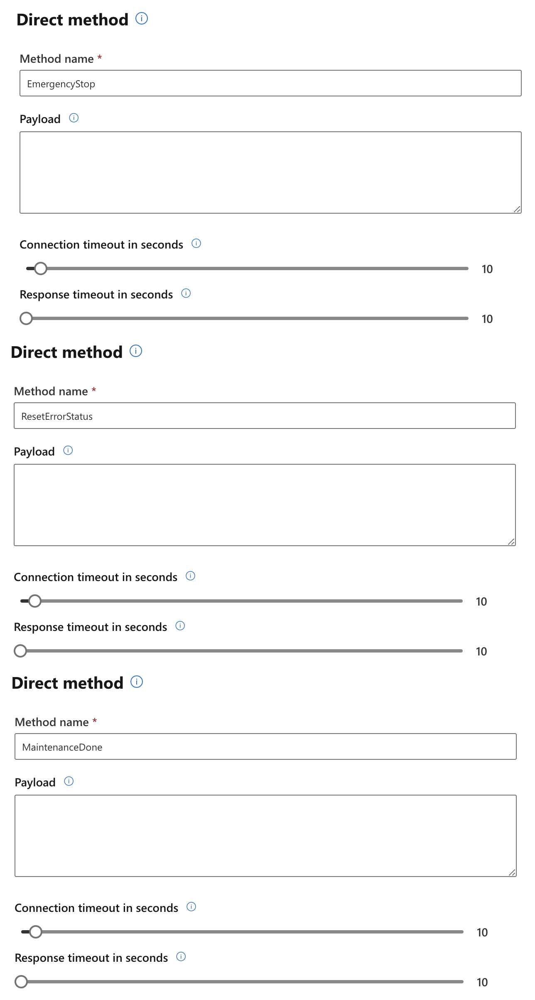

# Projekt IoT

## Połączenie z urządzeniem (serwerem OPC UA)
Aby połączyć się z serwerem OPC UA korzystamy z biblioteki (klienta OPC UA) [**asyncua**](https://github.com/FreeOpcUa/opcua-asyncio). Tworzymy instancje klienta podając adres z pliku konfiguracyjnego *config.ini*.

Przykładowy plik:
```ini
[server]
url = opc.tcp://localhost:4840/
```

Gdy połączenie zostanie nawiązane, pobieramy informacje na temat urządzeń, po czym tworzymy instancje klasy `Agent` dla każdego urządzenia. Podczas tworzenia przekazujemy jako argumenty instancje klasy `Device` oraz `connection_string`. Następnie dla stworzonego Agenta tworzymy nasłuchiwanie (subskrypcję) na parametry `ProductionRate` oraz `DeviceError`.

Na końcu dla wszystkich agentów w nieskończonej pętli w koło zgarniamy i wykonujemy wszystkie zakolejkowane zadania (wszystkie taski jak i aktualizowanie danych o urządzeniach następuje co 1 sekundę).

## Konfiguracja agenta

Proces konfiguracja agenta polega na pobraniu jego ustawień z pliku konfiguracyjnego `config.ini`. W pliku tym znajduje się zapytany `connection_string` dla każdego urządzenia. W przypadku kiedy dla urządzenia w pliku konfiguracyjnym nie ma `connection_string`, użytkownik zostaje o niego zapytany, a odpowiedź zostaje zapisana. Przy tworzeniu agenta, zostaje także przekazana instancja klasy `Device` o wszystkimi metodami potrzebnymi to kontroli nad urządzeniem.

Przykładowa konfiguracja:
```ini
[devices]
device 1 = connection_string
```

Tworzenie instancji Agenta:
```python
agent = Agent.create(Device.create(device), connection_string)
```

## Komunikacja D2C

Agent wysyła informacje do IoTHuba co jedną sekundę w przypadku telemetrii i w przypadku wystąpienia błędu z maksymalnie 500 milisekundowym opóźnieniem (subskrypcja sprawdza obserwowane parametry co 500ms)

Przykładowe dane telemetryczne:
```json
{
  "body": {
    "WorkorderId": "8351269d-ded6-4137-8f5a-50e67266107c",
    "ProductionStatus": 1,
    "GoodCount": 19,
    "BadCount": 1,
    "Temperature": 69.06481843075575,
    "message_type": "telemetry"
  },
  "enqueuedTime": "Wed Dec 28 2022 20:36:01 GMT+0100 (Central European Standard Time)",
  "properties": {}
}
```

Przykładowe dane na temat występującego błędu:
```json
{
  "body": {
    "DeviceError": "Power Failure",
    "message_type": "event"
  },
  "enqueuedTime": "Wed Dec 28 2022 20:35:59 GMT+0100 (Central European Standard Time)",
  "properties": {}
}
```

## Device Twin

W device twin przechowywane są informacje na temat aktualnego tempa produkcji, aktualnie występujących błędach, czasie w jakim wystąpił ostatni błąd oraz czasie kiedy to został on naprawiony.

Dodatkowo w obiekcie `desired` możemy przekazać informacje na temat pożadanego tempa produkcji (pod kluczem `ProductionRate`), informacja ta zostanie pobrana przez urządzenie i zostanie ona zastosowana.

Przykładowy Device Twin:
```json
{
	"deviceId": "device-1",
	"etag": "AAAAAAAAAAM=",
	"deviceEtag": "MjA5NDIyODU3",
	"status": "enabled",
	"statusUpdateTime": "0001-01-01T00:00:00Z",
	"connectionState": "Disconnected",
	"lastActivityTime": "2022-12-28T19:37:28.5271067Z",
	"cloudToDeviceMessageCount": 0,
	"authenticationType": "sas",
	"x509Thumbprint": {
		"primaryThumbprint": null,
		"secondaryThumbprint": null
	},
	"modelId": "",
	"version": 40,
	"properties": {
		"desired": {
			"ProductionRate": 17,
			"$metadata": {
				"$lastUpdated": "2022-12-27T22:34:32.1582791Z",
				"$lastUpdatedVersion": 3,
				"ProductionRate": {
					"$lastUpdated": "2022-12-27T22:34:32.1582791Z",
					"$lastUpdatedVersion": 3
				}
			},
			"$version": 3
		},
		"reported": {
			"LastMaintenanceDate": "2022-12-27T00:48:32.086007",
			"ProductionRate": 40,
			"device_error": [
				"Power Failure"
			],
			"LastErrorDate": "2022-12-28T20:35:59.843066",
			"$metadata": {
				"$lastUpdated": "2022-12-28T19:36:00.0190562Z",
				"LastMaintenanceDate": {
					"$lastUpdated": "2022-12-26T23:48:32.153909Z"
				},
				"ProductionRate": {
					"$lastUpdated": "2022-12-28T19:35:50.4876562Z"
				},
				"device_error": {
					"$lastUpdated": "2022-12-28T19:36:00.0190562Z"
				},
				"LastErrorDate": {
					"$lastUpdated": "2022-12-28T19:35:59.8628275Z"
				}
			},
			"$version": 37
		}
	},
	"capabilities": {
		"iotEdge": false
	}
}
```

## Direct Methods

Agent posiada zaimplementowane 3 metody:
- EmergencyStop
- ResetErrorStatus
- MaintenanceDone

Metody te nie potrzebują podawania żadnych argumentów oraz zwracają tylko wiadomość "OK" z statusem 200.

Przykłady wywołania metod:


## Kalkulacje danych i logika biznesowa

### Kalkulacja danych

Do kalkulacji wykorzystane zostały kwerendy z Azure Stream Analytics. Przy ich pomocy przetwarzamy dane pochodzące z danych telemetrycznych wysyłanych do IoT Huba przez Agenta. 

Kwerendy użyte do kalkulacji:

```sql
-- produkcja per workorderId
SELECT
    WorkorderId,
    SUM(GoodCount) AS GoodCountSum,
    SUM(BadCount) AS BadCountSum
INTO [asa-out-production-counts]
FROM [asa-in-iothub] TIMESTAMP BY EventEnqueuedUtcTime
GROUP BY
    WorkorderId, TumblingWindow(minute , 15)

-- production kpi
SELECT
    (SUM(GoodCount) / (SUM(GoodCount) + SUM(BadCount))) AS ProductionKPI
INTO [asa-out-kpi]
FROM [asa-in-iothub] TIMESTAMP BY EventEnqueuedUtcTime
GROUP BY
    TumblingWindow(minute , 15)

-- minimalna, maksymalna i średnia temperatura
SELECT
    WorkorderId,
    AVG(Temperature) AS AvgTemp,
    MIN(Temperature) AS MinTemp,
    MAX(Temperature) AS MaxTemp
INTO [asa-out-machine-temperatures]
FROM [asa-in-iothub] TIMESTAMP BY EventEnqueuedUtcTime
GROUP BY
    WorkorderId, TumblingWindow(minute , 5)

-- błędy w 15 minutowym okienku
SELECT ih.IoTHub.ConnectionDeviceId, COUNT(message_type) as errors
INTO [asa-out-error-per-machine]
FROM [asa-in-iothub] ih TIMESTAMP by EventEnqueuedUtcTime
WHERE message_type = 'event'
GROUP BY
    message_type, ih.IoTHub.ConnectionDeviceId, TumblingWindow(minute , 15)
HAVING count(message_type) > 3
```

### Logika biznesowa

Do wykonywania logiki biznesowej zostały wykorzystane kwerendy z Azure Stream Analytics w połączeniu z funkcjami z Function App (funkcje te są wyjściem dla wyników z kwerend).

Kwerendy odpowiadające za obliczanie danych dla funkcji:
```sql
--- awaryjne zatrzymanie dla funkcji
SELECT ih.IoTHub.ConnectionDeviceId, COUNT(message_type) as errors
INTO [asa-out-emergency-stop-http-trigger]
FROM [asa-in-iothub] ih TIMESTAMP by EventEnqueuedUtcTime
WHERE message_type = 'event'
GROUP BY
    message_type, ih.IoTHub.ConnectionDeviceId, TumblingWindow(minute , 15)

-- production kpi dla funkcji
SELECT
    (SUM(GoodCount) / (SUM(GoodCount) + SUM(BadCount))) AS kpi,
    System.Timestamp() AS WindowEndTime
INTO [asa-out-production-kpi-http-trigger]
FROM [asa-in-iothub] TIMESTAMP BY EventEnqueuedUtcTime
GROUP BY
    TumblingWindow(minute , 15)
```

Funkcje po otrzymaniu danych i zajściu wyznaczonych warunków wywołują dostępne dla urządzenia metody poprzed C2D.